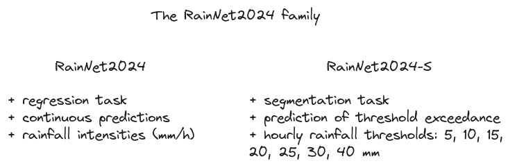
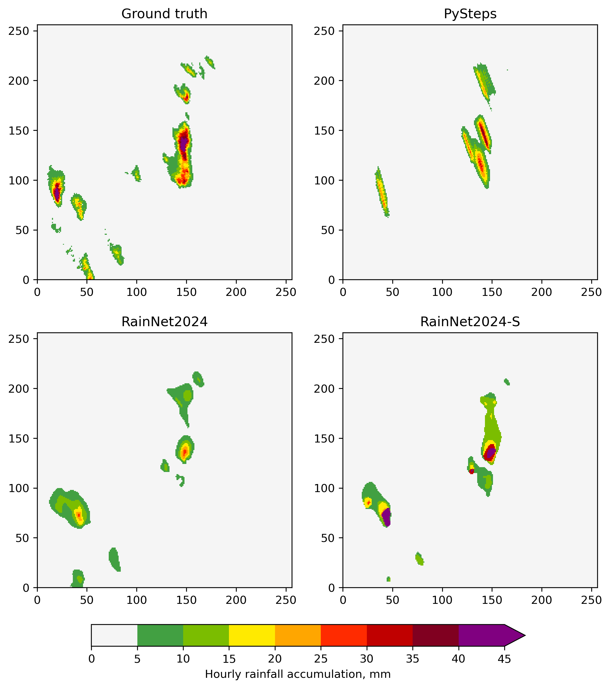

# The RainNet2024 family of deep neural networks for precipitation nowcasting

This repository supports our paper submitted to [NHESS](https://www.natural-hazards-and-earth-system-sciences.net/):

> Ayzel, G., and Heistermann, M. "Brief Communication: Training of AI-based nowcasting models for rainfall early warning should take into account user requirements."

The RainNet2024 family's model configurations alongside the pre-trained weights are available at Zenodo:

[](https://doi.org/10.5281/zenodo.12547127)

## TL;DR

We have developed the new set of deep learning models for precipitation nowcasting which continue our work in the field started from the development of the [RainNet](https://github.com/hydrogo/rainnet) (hereafter RainNet2020; [paper](https://gmd.copernicus.org/articles/13/2631/2020/)).

The RainNet2024 family consists of two types of models:
1. RainNet2024: a significant update of the RainNet2020 model, still providing predictions of rainfall intensities over the next 5 minutes (regression task).
2. RaiNet2024-S: set of models, each of those predicts the probability of threshold exceedance over the particular threshold of hourly rainfall accumulation (segmentation task). The thresholds are 5, 10, 15, 20, 25, 30, and 40 mm. 



The source of model configurations -- the [segmentation-models](https://github.com/qubvel/segmentation_models) library developed by [Pavel Iakubovskii](https://github.com/qubvel).

## RainNet2024

While the predecessor model -- [RainNet2020](https://github.com/hydrogo/rainnet) -- follows the structure of a standard [U-net model](https://arxiv.org/abs/1505.04597) with some modifications regarding its depth and number of convolutional layers, RainNet2024 utilizes the EfficientNetB4 model as a decoder branch (backbone) for feature extraction. 

Using the `segmentation_models` library, the RainNet2024 can be easily initialized as [Keras Model](https://keras.io/api/models/) instance in one line of code:

```python
import segmentation_models as sm

rainnet2024 = sm.Unet(backbone_name="efficientnetb4",
                      encoder_weights=None,
                      classes=1,
                      activation="linear",
                      input_shape=(256, 256, 4))
```
The pretrained model from the respective [zenodo repository](https://doi.org/10.5281/zenodo.12547127) can be load as follows:

```python
from tensorflow.keras.models import load_model
from efficientnet.tfkeras import EfficientNetB4
import segmentation_models as sm

model =  load_model(f"rainnet2024.keras", 
                    custom_objects= {
                    'jaccard_loss': sm.losses.JaccardLoss(),
                    'iou_score': sm.metrics.IOUScore(),
                    'bce_loss': sm.losses.BinaryCELoss()})
```


## RainNet2024-S

While the RainNet2024 follows the standard approach for precipitation nowcasting, i.e., it predicts rainfall intensity in each grid cell for the next time step, the set of RainNet2024-**S** models predicts the probability of exceedance of the particular rainfall accumulation for the next hour. In our [paper submission](https://www.natural-hazards-and-earth-system-sciences.net/), we used seven different thresholds: 5, 10, 15, 20, 25, 30, and 40 mm. Thus, you can find the corresponding set of seven pre-trained models in the respective [zenodo repository](https://doi.org/10.5281/zenodo.12547127). Loading model is similar to the process described above for the RainNet2024 model. 


```python
import segmentation_models as sm

rainnet2024 = sm.Unet(backbone_name="efficientnetb4",
                      encoder_weights=None,
                      classes=1,
                      activation="sigmoid",
                      input_shape=(256, 256, 4))
```


## Computation environment

`rainnet2024_environment.yml` file provides [conda environment](https://conda.io/projects/conda/en/latest/user-guide/tasks/manage-environments.html) with all the necessary dependencies for working with the RainNet2024 family of models, as well as standard models from the [PySteps](https://github.com/pySTEPS/pysteps) library and radar data processing procedures.

## Data

+ YW
+ CatRaRE

## Training

Table with data split: number of events/instances in each fold

preprocessing, loss, optimizer, epochs (20). LR reduction.

Model weights are available on zenodo: "fill in".

## Evaluation

+ CSI
+ FSS

## Sample event

+ YW data for a single event



## Operational setting

+ copy from KISTERS's script

<!-- Note on overconfidence with jaccard loss  vs. bce -->

