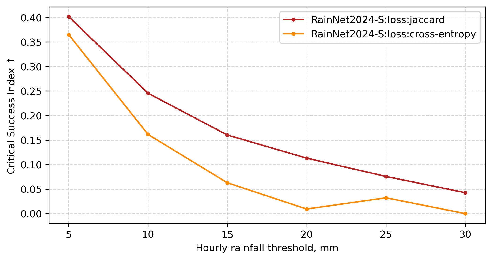

# The RainNet2024 family of deep neural networks for precipitation nowcasting

This repository supports our paper submitted to [NHESS](https://www.natural-hazards-and-earth-system-sciences.net/):

> Ayzel, G., and Heistermann, M. "Brief Communication: Training of AI-based nowcasting models for rainfall early warning should take into account user requirements."

The RainNet2024 family's model configurations alongside the pre-trained weights are available at Zenodo:

[](https://doi.org/10.5281/zenodo.12547127)


## TL;DR

We have developed the new set of deep learning models for precipitation nowcasting which continue our work in the field started from the development of the [RainNet](https://github.com/hydrogo/rainnet) (hereafter RainNet2020; [paper](https://gmd.copernicus.org/articles/13/2631/2020/)).

The RainNet2024 family consists of two types of models:
1. RainNet2024: a significant update of the RainNet2020 model, still providing predictions of rainfall intensities over the next 5 minutes (regression task).
2. RaiNet2024-S: set of models, each of those predicts the probability of threshold exceedance over the particular threshold of hourly rainfall accumulation (segmentation task). The thresholds are 5, 10, 15, 20, 25, 30, and 40 mm. 


The source of model configurations -- the [segmentation-models](https://github.com/qubvel/segmentation_models) library developed by [Pavel Iakubovskii](https://github.com/qubvel).


## RainNet2024

While the predecessor model -- [RainNet2020](https://github.com/hydrogo/rainnet) -- follows the structure of a standard [U-net model](https://arxiv.org/abs/1505.04597) with some modifications regarding its depth and number of convolutional layers, RainNet2024 utilizes the EfficientNetB4 model as a decoder branch (backbone) for feature extraction. 

Using the `segmentation_models` library, the RainNet2024 can be easily initialized as [Keras Model](https://keras.io/api/models/) instance in one line of code:

```python
import segmentation_models as sm

rainnet2024 = sm.Unet(backbone_name="efficientnetb4",
                      encoder_weights=None,
                      classes=1,
                      activation="linear",
                      input_shape=(256, 256, 4))
```
The pretrained model from the respective [zenodo repository](https://doi.org/10.5281/zenodo.12547127) can be load as follows:

```python
from tensorflow.keras.models import load_model
from efficientnet.tfkeras import EfficientNetB4
import segmentation_models as sm

model =  load_model(f"rainnet2024.keras", 
                    custom_objects= {
                    'jaccard_loss': sm.losses.JaccardLoss(),
                    'iou_score': sm.metrics.IOUScore(),
                    'bce_loss': sm.losses.BinaryCELoss()})
```


## RainNet2024-S

While the RainNet2024 follows the standard approach for precipitation nowcasting, i.e., it predicts rainfall intensity in each grid cell for the next time step, the set of RainNet2024-**S** models predicts the probability of exceedance of the particular rainfall accumulation for the next hour. In our [paper submission](https://www.natural-hazards-and-earth-system-sciences.net/), we used seven different thresholds: 5, 10, 15, 20, 25, 30, and 40 mm. Thus, you can find the corresponding set of seven pre-trained models in the respective [zenodo repository](https://doi.org/10.5281/zenodo.12547127). Loading model is similar to the process described above for the RainNet2024 model. 


```python
import segmentation_models as sm

rainnet2024 = sm.Unet(backbone_name="efficientnetb4",
                      encoder_weights=None,
                      classes=1,
                      activation="sigmoid",
                      input_shape=(256, 256, 4))
```


## Computation environment

`rainnet2024_environment.yml` file provides [conda environment](https://conda.io/projects/conda/en/latest/user-guide/tasks/manage-environments.html) with all the necessary dependencies for working with the RainNet2024 family of models, as well as standard models from the [PySteps](https://github.com/pySTEPS/pysteps) library and radar data processing procedures.


## Data

We use two sources of data to develop our training, validation, and testing datasets:
1. [YW](https://opendata.dwd.de/climate_environment/CDC/help/landing_pages/doi_landingpage_RADKLIM_RW_V2017.002-en.html) radar composite developed by the German Weather Service (DWD). It is freely available, quality-controlled, and regularly updated dataset that provides weather radar data with a spatial coverage of 1110x900 km (Germany and some neighboring countries), spatial resolution of 1 km, and temporal resolution of 5 min since 2001. 
2. [CatRaRE](https://www.dwd.de/EN/ourservices/catrare/catrare.html) (Catalogues of heavy precipitation events) dataset. Also freely available and regularly updated, CatRaRE provides an information about extreme precipitation events and their properties since 2001. The utilization of the CatRaRE dataset helps us to guide the training of the RainNet2024 family of models towards extreme and impact-relevant events.


## Data preprocessing

The CatRaRE dataset provides information about event properties such as time of start and end, spatial location. Using these properties, we use YW radar data to prepare data cubes for each described event that has a duration less than 6 hours (85% of the entire CatraRe dataset. 19613 events in total). 

Each data cube has a spatial extent of 256x256 km, and temporal extent of event's duration (in 5 min time steps) +- 1 hour as a temporal buffer. We saved produced data cubes in `.npy` (numpy binary) format to ease their further use for training, validations, and testing procedures.

|                  | Training  | Validation | Testing   |
|------------------|-----------|------------|-----------|
| Period           | 2001-2015 | 2016-2018  | 2019-2020 |
| Number of events | 13400     | 4103       | 2110      |
| Percentage       | 68        | 21         | 11        |

We provide a data sample of a single event in `data` folder.


## Training

The main difference between the set of RainNet2024 models and RainNet2020 is in training procedure. While RainNet2020 was trained on a wider spatial domain (928x928 km) towards precipitation data of summer months from the period from 2006 to 2013, RaiNet2024 models utilize reduced spatial domain (256x256 km) with the focus on extreme events collected in the CatRaRE dataset. In this way, for the RainNet2024 family, we intentionally put the focus on dynamic events with high precipitation intensities -- ones that were problematic to nowcast for RainNet2020.

For each period (train, validation, or test) and precipitation threshold (5, 10, 15, 20, 25, 30, 40 mm), we evaluated the corresponding CatRaRE events and created an index that collects the event's ID and the specific timestep of the data cube when the hourly rainfall is equal to or exceeds the threshold. For RainNet2024-S training and validation, we used only data relevant to the particular threshold exceedance while for threshold-agnostic RainNet2024, we used the full index as obtained from a threshold exceedance of 5 mm.

We used the mean squared error (MSE) loss for RainNet2024, and the Jaccard loss (also referred as Intersection over Union, IoU) for the set of RainNet2024-S models. We also utilized [Adam](https://arxiv.org/abs/1412.6980) optimizer to perform weights optimization procedure. Training was set for 20 epochs with a simple learning rate reduction policy: if the validation loss did not decrease for two consecutive epochs, we reduced the learning rate by a factor of 0.1.

The pseudo code for training a threshold-specific RainNet2024-S model is shown below:

```python
import numpy as np
import tensorflow as tf
from tensorflow.keras.utils import Sequence
import segmentation_models as sm

# loading respective index files, e.g., as following:
# ["10001_12", "10001_13",...,"20518_35", "20518_36"]
training_index = np.load("path/to/training/index")
validation_index = np.load("path/to/validation/index")

# create a Keras Sequence class for training 
# and validation data delivery
class DLSequence(Sequence):

    # data IO and preprocessing is here
    #...

    return batch_x, batch_y 

# set-up the respective sequences
training_seq = DLSequence(...)
validation_seq = DLSequence(...)

# model initialization (see the respective 
# section above for more details)
model = sm.Unet(...)

# compilation of model
# provides ready-to-run instance
# note: loss is "mse" for RainNet2024
# and "jaccard" (sm.losses.JaccardLoss()) for RainNet2024-S
model.compile(optimizer="Adam", loss=...)

# setting-up Keras callbacks
# 1. Reduction of learning rate while on plateau
reduceLR = tf.keras.callbacks.ReduceLROnPlateau(monitor='val_loss', min_delta=0.0001, mode="min", patience=2, factor=0.1)

# 2. Saving the best model regarding validation loss
checkpoint = tf.keras.callbacks.ModelCheckpoint(filepath=..., save_weights_only=False, monitor='val_loss', mode='min', save_best_only=True)

# Run training and validation
model.fit(training_seq, validation_data=validation_seq,
epochs=20, callbacks=[reduceLR, checkpoint])
```


## Evaluation

To evaluate model performance on the test period, we use two [community-approved metrics](https://cawcr.gov.au/projects/verification/):

1. Critical Success Index (CSI)


2. Fractions Skill Score (FSS)


## Sample event

Here we provide predictions of rainfall accumulation over the next hour calculated by different models for the exemplary event (CatRaRE ID: 20815; time step: 24).


The YW data sample for the exemplary event (CatRaRE ID: 20815) is available in `data` folder.

The code for model execution and figure plotting is available in `example_sample_event.ipynd` Jupyter Notebook.


## Operational setting

You can run the family of RainNet2024 models operationally. The respective code is provided in `example_operational.ipynb` Jupyter Notebook (the standard model from the PySteps library is also available).


## Further notes

### Choice of the loss function: jaccard vs. cross-entropy

For training RainNet2024-S models, we used the Jaccard loss function. The underlying reason for that was a direct optimization towards CSI (Critical Success Index) -- the widely used community-approved metric for evaluation of precipitation nowcasts. However, as was pointed out by [Leinonen et al. (2022; Fig. 5)](https://journals.ametsoc.org/view/journals/aies/1/4/full-AIES-D-22-0043.1-f5.jpg), model which is trained using the CSI (==Jaccard) loss function does not provide calibrated probabilities. That means, that the output of RainNet2024-S models could not be considered as "probabilities" of threshold exceedance. Instead, (binary) cross-entropy loss can be effectively utilized to obtain calibrated probabilities.

While using cross-entropy can be beneficial for particular user groups and decision-makers, the set of benchmark experiments showed the clear advantage of using the Jaccard loss for maximizing the CSI metric on test data.




## References

```
Leinonen, J., Hamann, U., & Germann, U. (2022). Seamless lightning nowcasting with recurrent-convolutional deep learning. Artificial Intelligence for the Earth Systems, 1(4), e220043.
```